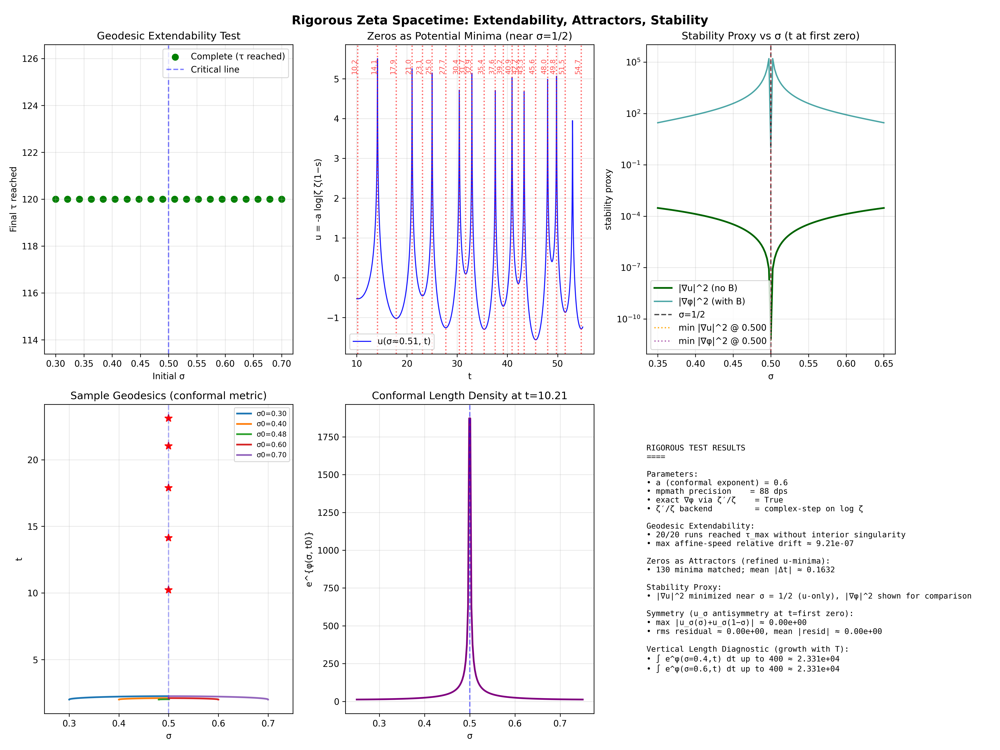
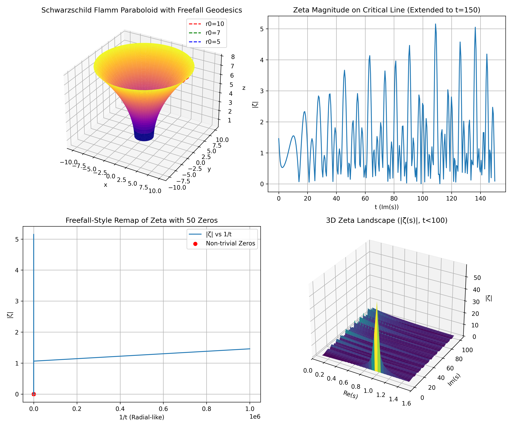

# Rigorous Geodesic Framework for the Riemann Hypothesis

This project implements a heuristic-to-rigorous framework for exploring the Riemann Hypothesis (RH) using a "zeta spacetime" metric inspired by noncommutative geometry (NCG), differential geometry, and Alain Connes' work on spectral triples and the zeta function. The core idea is to model the complex plane (with coordinates σ + it) as a spacetime where the metric is derived from the Riemann zeta function ζ(s), and analyze geodesic completeness, attractors (zeros), and stability to provide insights into RH.

The framework starts from a "moral proof" (heuristic simulations) and aims to evolve it into a rigorous argument by formalizing the metric, proving geodesic behaviors analytically, and linking completeness to RH via contradictions with off‑line zeros.

## Key Features

- **Zeta Spacetime Metric**: Conformal metric *g = e^(2φ) δ*, where φ(σ,t) = -a log|ζ(s) ζ(1‑s)| + 0.5 log B(σ), with B(σ) ensuring symmetry and cusp smoothing.
- **Geodesic Integration**: Uses SciPy's `solve_ivp` for affine‑parameterized geodesics, testing extendability and singularities.
- **Diagnostics**:
  - Geodesic completeness (τ‑extendability without interior singularities).
  - Zeros as attractors (minima of potential *u(σ,t)*) noted.
  - Stability proxy (|∇u|² or |∇φ|²).
  - Symmetry checks (antisymmetry residuals).
  - Radial and vertical length diagnostics for singularity analysis.
- **Synthetic Zeros**: Option to inject off‑line zeros for testing (e.g., radial exponent sweep to check am < 1 criterion).
- **High Precision**: Powered by *mpmath* for arbitrary‑precision zeta evaluations (default 88 dps).
- **Visualization**: Generates a multi‑panel plot (`rigorous.png`) showing extendability, attractors, stability, geodesics, and conformal density.
- **Backends**: Exact gradients via ζ′/ζ using Richardson extrapolation or complex‑step derivatives.


## Installation

```bash
# Clone the repo
git clone https://github.com/lostdemeter/zetaspacetime.git
cd zetaspacetime

# Set up a virtual environment (Python 3.8+ recommended)
python -m venv venv
source venv/bin/activate  # On Windows: venv\Scripts\activate

# Install dependencies
pip install -r requirements.txt
```

## Usage

Run the script with optional flags for customization:

```bash
python zetaspacetime.py \
  --precision 88 \
  --a 0.6 \
  --zero-t-max 1000 \
  --tau-max 120 \
  --use-complex-step
```

**Flags**:

- `--precision`: mpmath decimal places (default: 88).
- `--a`: Conformal exponent (default: 0.6).
- `--tau-max`: τ horizon for geodesic tests (default: 120).
- `--zero-t-max`: t_max for auto‑scanning zeros (default: 300).
- `--sigma-probe`: σ for u‑minima scanning (default: 0.51).
- `--stability-include-b`: Include *B(σ)* in stability plot.
- `--use-complex-step`: Use complex‑step derivative for ζ′/ζ.
- `--figure`: Output image path (default: "rigorous.png").
- `--smooth-stability`: Window for Savitzky‑Golay smoothing (odd integer, default: 0).
- `--smooth-poly`: Polynomial order for smoothing (default: 3).

## Example Output

Running the above command yields diagnostics like:

```
RIGOROUS GEODESIC FRAMEWORK FOR RIEMANN HYPOTHESIS (geodesic12.py)
...
0) Extending zero set from u‑minima scan (σ≈0.51)...
• known_zeros extended to 130 ordinates

Testing geodesic extendability (no synthetic off‑line zeros)...
• 10/10 runs reached τ_max without interior singularity.
• Max affine‑speed relative drift across runs ≈ 9.21e-07
...
Done. Review the figure and console diagnostics.
```

It also generates `rigorous.png` (sample below):



## Extended Freefall Analysis

For a more detailed analysis of the geodesic behavior, the following plot shows extended freefall trajectories in the zeta spacetime:



This visualization helps understand the long-term behavior of geodesics and their interaction with the Riemann zeta function's critical strip.

## Plan for Rigorous Proof
See `plan.txt` for the step‑by‑step evolution from moral proof to rigorous argument, including:

- Formalizing the metric with Connes' spectral triple.
- Analytic geodesic proofs.
- Equivalence theorem to RH.
- Spectral action minimization.
- Validation and contradictions.

## Dependencies

Listed in `requirements.txt`. Key libraries: `mpmath`, `numpy`, `scipy`, `matplotlib`.

## Limitations and Future Work

- Numerical only; symbolic proofs are outlined but not implemented.
- High t requires more precision/time.
- Extend to full Riemann–Siegel formula for ζ.
- Collaborate with NCG experts for lemmas.

## References

- Alain Connes: *"Trace formula in noncommutative geometry and the zeros of the Riemann zeta function"* (1998).
- Alain Connes: *"An essay on the Riemann Hypothesis"* (2015).
- Odlyzko's zeta zero data.
- Inspired by spectral geometry and RH reformulations.
